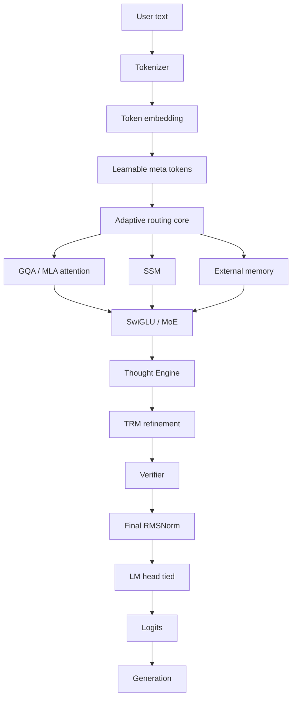

# Janus Architecture

## Dataflow

## Layers
1. **Embedding**: token embedding tied with LM head. Meta tokens prepended/interleaved as learnable vectors.
2. **Backbone block (hybrid)**: alternating Attention and SSM blocks (e.g. A,S,A,S,A,S); each followed by SwiGLU FFN or MoE FFN; pre-norm RMSNorm; residual connections; RoPE in attention.
3. **Adaptive router**: per-token (or per-segment) decision among {ATTENTION, SSM, MOE, THOUGHT, MEMORY}. Must be differentiable or trained with a stated estimator; must have a compute-budget penalty and a collapse monitor. Start with a fixed hybrid, then enable routing behind a flag.
4. **Thought Engine**: hidden iterative refinement of a latent state; no exposed chain-of-thought.
5. **TRM**: recursive refine loop with a halting decision; max steps configurable; verifier-gated.
6. **Verifier**: lightweight head producing accept/continue signals and structured-output checks.
7. **External memory**: SQLite store + embeddings + retriever + ranker + controller; read/write gated by the router.

## Incompatibility watchlist (analyze before combining)
- MLA latent KV vs KV-cache sharing across layers.
- SSM state vs adaptive routing (skipped tokens break recurrent state continuity).
- MoE routing vs adaptive routing (two routers: define precedence and joint load-balancing).
- TRM loops vs KV cache (cache invalidation on refinement).
- Meta tokens vs causal masking and context-length accounting.
Each conflict gets an explicit decision note in `docs/DECISIONS.md` and a separate experiment variant.

## Variants (ModelFactory)
JANUS-DENSE, JANUS-GQA, JANUS-MLA, JANUS-HYBRID, JANUS-HYBRID-MOE, JANUS-HYBRID-THOUGHT, JANUS-HYBRID-MEMORY, JANUS-125.

## Component flags (config)
`attention, gqa, mla, ssm, moe, meta_tokens, adaptive_routing, thought_engine, trm, memory, verifier`.

## Deliverable of Phase 00 from the Architect AI
Module graph, tensor dimensions, layer arrangement, parameter budget, FLOPs and memory estimates, training and inference implications, incompatibilities, ablation variants. Saved to `docs/specification.md` after Director approval.
